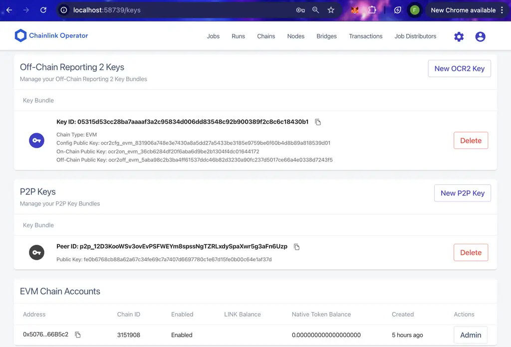

# 🔗 Chainlink Node Package for Kurtosis 🚀

> *Easily deploy and setup Chainlink Node infrastructure in isolated test environments with one command.*

## 🌐 Overview

This package allows you to deploy and configure Chainlink Nodes in isolated, reproducible environments using [Kurtosis](https://kurtosis.com/).

## 🚀 Key Capabilities

- 🛠️ **Node Deployment & Management**:
  - Deploy multiple Chainlink nodes in parallel with one command
  - Manage cryptographic keys (ETH, VRF, P2P, OCR) securely
  - Configure node resources and PostgreSQL databases automatically

- ⚡ **Oracle Services & Jobs**:
  - 🎲 VRF: Verifiable randomness for gaming, NFTs and fair selection
  - 📊 OCR: Scalable, cost-efficient price feeds and data delivery
  - 🔄 Automation: Condition-based smart contract maintenance
  - 📈 Direct Request: Custom on-demand data fetching from any API
  - 🌉 DKG: Distributed Key Generation for threshold cryptography

- 🏗️ **Advanced Off-chain/On-chain Workflows/Automations**:
  - Architect powerful data pipelines bridging external systems to smart contracts
  - Orchestrate precise time-based and event-driven contract executions
  - Process and transform data through custom validation logic
  - Deploy sophisticated off-chain computation with on-chain verification
  - Connect seamlessly with external APIs and proprietary data sources

- 🌐 **Cross-Chain Operations** (Coming soon):
  - CCIP: Securely transfer tokens and data between blockchains
  - Multi-chain oracle network coordination
  - Cross-chain messaging and verification services

## ✨ Features

- **Multi-Node Support**: Deploy multiple Chainlink nodes with different configurations
- **PostgreSQL Database**: Each node comes with its own PostgreSQL database
- **Blockchain Integration**: Connect to any EVM-compatible blockchain
- **Job Templates**: Pre-configured job templates for OCR2, BHS/BHF, and VRF functionalities
- **Comprehensive Toolkit**: Rich set of functions for key management, job deployment, network configuration, and node orchestration
- **Configurable Resources**: Fine-tune CPU and memory allocation

## 📋 Prerequisites

| Requirement | Version |
|-------------|---------|
| [Kurtosis](https://docs.kurtosis.com/)    | >= 0.47.0 | 
| Docker/Kubernetes      | >= 20.10.0 |
| Disk Space  | >= 5GB |

## 🏃 Quick Start

<div style="display: flex; align-items: flex-start;">
<div style="flex: 1;">

1️⃣ Create a `config.yaml` file:

```yaml
network:
  rpc: http://host.docker.internal:8545
  ws: ws://host.docker.internal:8546
  chain_id: "1337"

chainlink_nodes:
  - node_name: "chainlink-1"
    image: "smartcontract/chainlink:latest"
    keystore_pw: "AtLeast16Characters!"
    api_user: "admin@chain.link"
    api_password: "StrongPassword123!"
```

2️⃣ Run the package:

```bash
kurtosis run github.com/your-org/chainlink-node-package --args-file config.yaml
```
3️⃣ Access your node(s) Operator UI:

| Node Name   | Web UI               |
|-------------|----------------------|
| chainlink-1 | http://localhost:6688 |

</div>
<div style="flex: 0 0 50%; padding-left: 5%; padding-top: 8px;">

</div>
</div>

## ⚙️ Configuration Reference (Args)

The package provides a powerful input parser that auto-fills most parameters. You only need to specify the network configuration and node names to determine how many nodes to deploy.

### 🌐 Network Configs (required)

| Parameter | Required | Description |
|-----------|----------|-------------|
| `rpc`     | ✅ Yes   | HTTP RPC endpoint URL |
| `ws`      | ✅ Yes   | WebSocket endpoint URL |
| `chain_id`| ✅ Yes   | Chain ID as string |

### 🔗 Chainlink Node Configuration

| Parameter     | Required | Default | Description |
|---------------|----------|---------|-------------|
| `node_name`   | ✅ Yes   | - | Unique name for the node |
| `image` | ❌ No  | `smartcontract/chainlink:latest` | Chainlink image version |
| `keystore_pw` | ❌ No  | - | Node keystore password (min 16 chars) |
| `api_user`    | ❌ No   | - | API/GUI username |
| `api_password`| ❌ No   | - | API/GUI password |

### 🗄️ PostgreSQL Configuration

| Parameter   | Required | Default | Description |
|-------------|----------|---------|-------------|
| `user`      | ❌ No    | `postgres` | Database username |
| `password`  | ✅ Yes   | - | Database password |
| `min_cpu`   | ❌ No    | 10 | Minimum CPU allocation |
| `max_cpu`   | ❌ No    | 1000 | Maximum CPU allocation |
| `min_memory`| ❌ No    | 32 | Minimum memory in MB |
| `max_memory`| ❌ No    | 1024 | Maximum memory in MB |

## 🔄 Advanced Usage

### 🖥️ Multi-Node Setup

```yaml
chainlink_nodes:
  - node_name: "vrf-primary"
    # Primary node config...
    
  - node_name: "vrf-backup"
    # Backup node config...
    
  - node_name: "monitoring"
    # Monitoring node config...
```

### 📝 Custom Job Templates

The package includes several pre-configured job templates that get preloaded in the node to be used to create jobs on demand:
- `ocr2vrf-job-template.toml`: OCR2 VRF job configuration
- `bhs-or-bhf-job-template.toml`: Block header service/feeder jobs
- `dkg-bootstrap-job-template.toml`: DKG bootstrapping job
- `dkg-job-template.toml`: DKG participant job
- `vrf2plus-job-template.toml`: VRF v2 Plus jobs

## 🛠️ Functions & API

This package provides Starlark functions for Chainlink Nodes setup and infrastructure management. **Note that only the `run` function is directly callable from the command line.** The other functions are internal to the package and used can be used only within Starlark scripts.

### 🚀 Main Function

| Function | Description | How to Use |
|----------|-------------|------------|
| `run` | Main entrypoint that deploys all nodes in parallel | Directly with `kurtosis run github.com/your-org/vrf-package --args-file config.yaml` |

### 🧩 Internal Starlark Functions

The following functions are used internally within the package's Starlark scripts. If you want to use these functions, you'll need to create custom Starlark scripts that import this package.

#### 🏗️ Infrastructure Setup

| Function | Description | Parameters |
|----------|-------------|------------|
| `create_node_database` | Creates a PostgreSQL database for a node | `plan`, `postgres_configs`, `node_name` |
| `create_node_config` | Creates a ServiceConfig for a node | `plan`, `chainlink_configs`, `postgres_output`, `chain_configs` |

#### 🔑 Key Management

| Function | Description | Parameters |
|----------|-------------|------------|
| `create_vrf_keys` | Creates VRF keys on a node | `plan`, `node_name` |
| `get_eth_key` | Gets first Ethereum key address | `plan`, `node_name` |
| `get_p2p_peer_id` | Gets P2P key and PeerID | `plan`, `node_name` |
| `get_ocr_key_bundle_id` | Gets OCR key bundle ID | `plan`, `node_name` |
| `get_ocr_key` | Gets OCR key details | `plan`, `node_name` |

#### 📋 Job Management

| Function | Description | Parameters |
|----------|-------------|------------|
| `create_ocr_job` | Creates an OCR Data Feed job | Various parameters for OCR configuration |
| `create_direct_request_job` | Creates a Direct Request job | Various parameters for Direct Request configuration |
| `create_cron_job` | Creates a time-based Cron job | Various parameters for Cron job configuration |
| `create_keeper_job` | Creates a Keeper job for automation | Various parameters for Keeper configuration |
| `create_webhook_job` | Creates a Webhook job for external triggers | Various parameters for Webhook configuration |
| `trigger_webhook_job` | Triggers a Webhook job via HTTP | `plan`, `node_name`, `job_id`, `payload` |
| `create_bootstrap_job` | Creates a DKG bootstrap job | `plan`, `dkg_contract_address`, `chain_id`, `node_name` |
| `create_bhs_or_bhf_job` | Creates a BHS or BHF job | Various parameters for job configuration |
| `create_vrfv2plus_job` | Creates a VRF v2 Plus job | Various parameters for VRF configuration |
| `create_dkg_job` | Creates a DKG job (v2.14 only) | Various parameters for DKG setup |
| `create_ocr2vrf_job` | Creates an OCR2 VRF job (v2.14 only) | Various parameters for OCR2 VRF setup |

#### 🌉 DKG Specific (v2.14 Only)

| Function | Description | Parameters |
|----------|-------------|------------|
| `create_dkg_encr_key` | Creates a DKG encryption key | `plan`, `node_name` |
| `create_dkg_sign_key` | Creates a DKG signing key | `plan`, `node_name` |

### 📝 Creating Custom Scripts

To leverage these internal functions, you'd need to create your own Starlark script:

```starlark
# Example custom script: setup_vrf_node.star
chainlink_package = import_module("github.com/your-org/vrf-package/main.star")
vrfv2plus = import_module("github.com/your-org/vrf-package/src/vrfv2plus.star")

def run(plan, args):
    # Deploy base nodes with chainlink_package.run
    result = chainlink_package.run(plan, args)
    
    # Get node reference
    node_name = args["target_node"]
    
    # Get ETH key for node
    eth_key = chainlink_package.get_eth_key(plan, node_name)
    
    # Create VRF keys
    vrf_keys = chainlink_package.create_vrf_keys(plan, node_name)
    
    # Create a VRF job
    chainlink_package.vrfv2plus.create_vrfv2plus_job(
        plan,
        args["vrf_coordinator"],
        args["batch_coordinator"],
        vrf_keys.compressed,
        args["chain_id"],
        eth_key,
        node_name
    )
    
    return struct(
        eth_key = eth_key,
        vrf_key = vrf_keys.compressed
    )
```

You would then run this custom script with:

```bash
kurtosis run ./setup_vrf_node.star --args-file myconfig.yaml
```

## 📝 Examples

<details>
<summary>Basic Node with Ganache</summary>

```yaml
network:
  rpc: http://host.docker.internal:8545
  ws: ws://host.docker.internal:8546
  chain_id: "1337"

chainlink_nodes:
  - node_name: "chainlink-local"
    image: "smartcontract/chainlink:latest"
    keystore_pw: "SuperSecretPassword123!"
    api_user: "admin@example.com"
    api_password: "AdminPassword123!"
```
</details>

<details>
<summary>Production-like Setup</summary>

```yaml
network:
  rpc: https://eth-mainnet.alchemyapi.io/v2/your-api-key
  ws: wss://eth-mainnet.alchemyapi.io/v2/your-api-key
  chain_id: "1"

chainlink_nodes:
  - node_name: "vrf-primary"
    image: "smartcontract/chainlink:2.23.0"
    keystore_pw: "VeryLongPasswordForSecurity123!!!"
    api_user: "admin@chain.link"
    api_password: "StrongAdminPasswordForPrimary!"
    postgres:
      user: "postgres"
      password: "DatabasePrimary123!"
      min_cpu: 100
      max_cpu: 2000
      min_memory: 128
      max_memory: 2048
      
  - node_name: "vrf-backup"
    image: "smartcontract/chainlink:2.23.0"
    keystore_pw: "DifferentPasswordForBackupNode456!!!"
    api_user: "admin@chain.link"
    api_password: "StrongAdminPasswordForBackup!"
    postgres:
      user: "postgres"
      password: "DatabaseBackup123!"
```
</details>
<br>

⭐ **Star this repo if you find it useful!** ⭐

Built with ❤️ by the Bloctopus team 🐙
